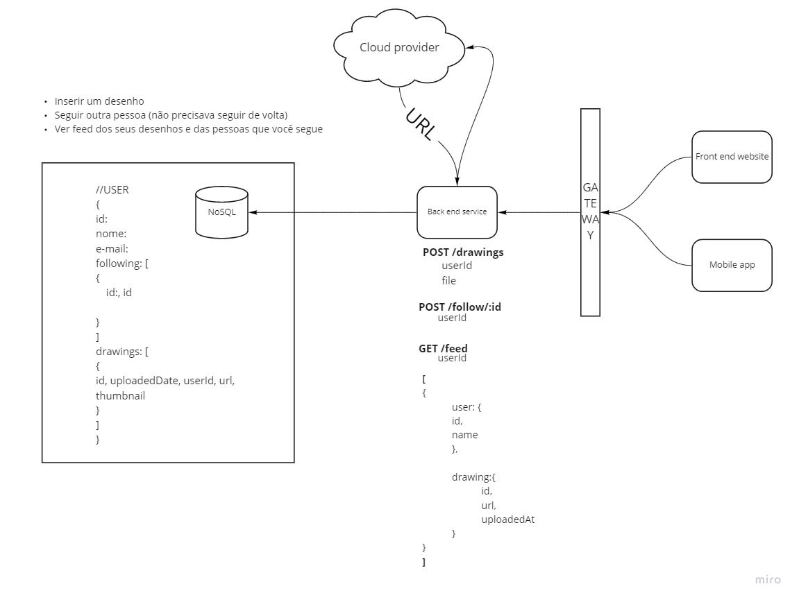
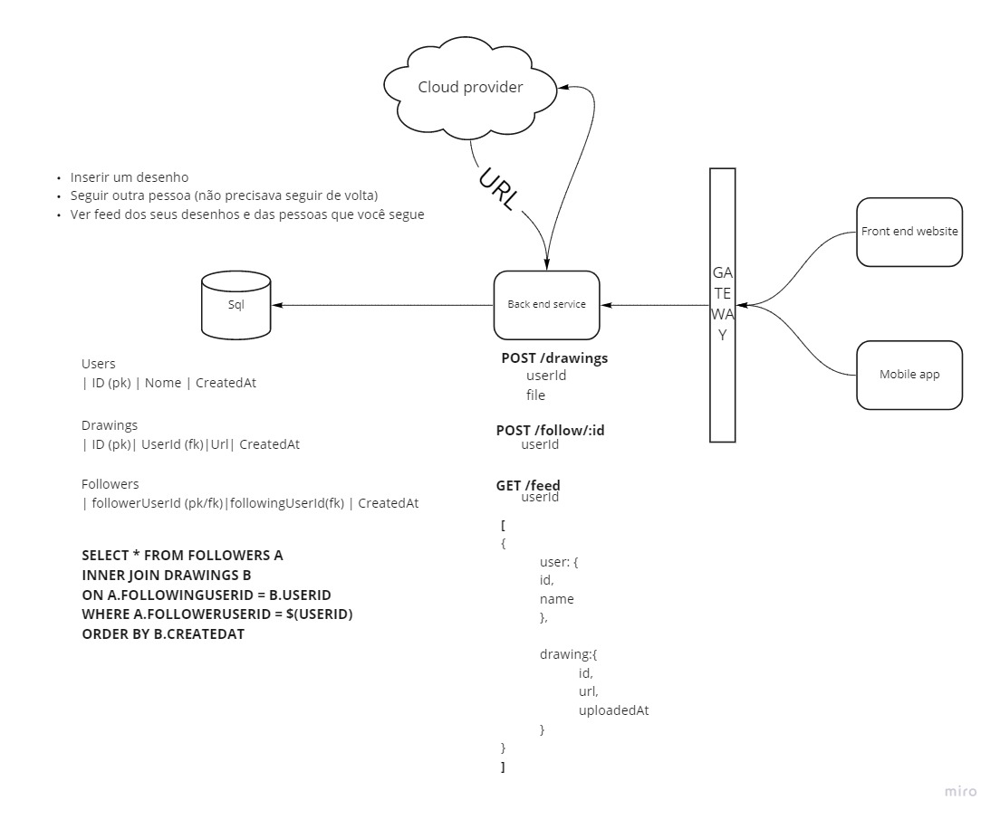

# Designing Pinterest

We were challenged to design an app that should behave like Pinterest.

### The needed features were:
* A user should be able to add a drawing
* A user should be able to follow another (no need to follow back)
* A user should be able to see its drawings and the drawings from the users he/she follows ordered by time posted.

We thought that there were no reason to try to design in terms of microservices nor using any kind of event sourcing. We prefered to stick with a simple monolith solution focused on the needed features.

## Using a NoSQL database

## Using a SQL database

