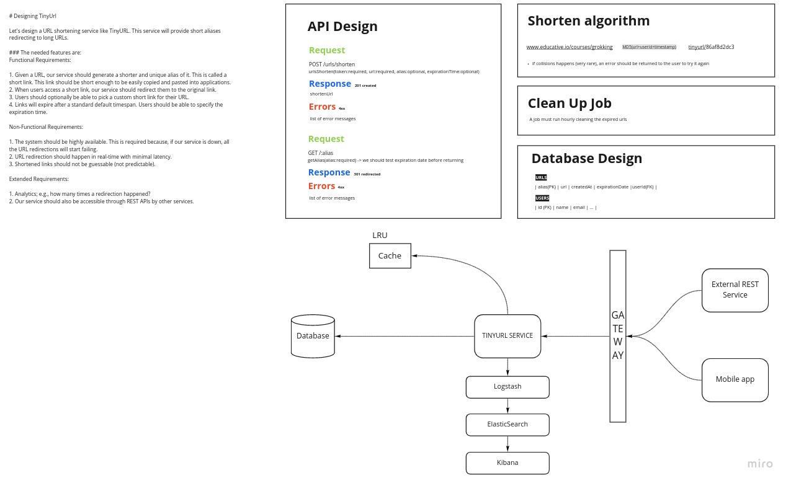

# Designing TinyUrl

Let's design a URL shortening service like TinyURL. This service will provide short aliases redirecting to long URLs.

### The needed features were:
Functional Requirements:

1. Given a URL, our service should generate a shorter and unique alias of it. This is called a short link. This link should be short enough to be easily copied and pasted into applications.
2. When users access a short link, our service should redirect them to the original link.
3. Users should optionally be able to pick a custom short link for their URL.
4. Links will expire after a standard default timespan. Users should be able to specify the expiration time.

Non-Functional Requirements:

1. The system should be highly available. This is required because, if our service is down, all the URL redirections will start failing.
2. URL redirection should happen in real-time with minimal latency.
3. Shortened links should not be guessable (not predictable).

Extended Requirements:

1. Analytics; e.g., how many times a redirection happened?
2. Our service should also be accessible through REST APIs by other services.Functional Requirements:

## Design

