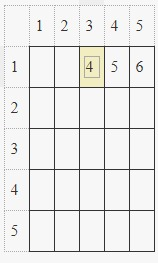

# Hash Tables: Ice Cream Parlor

[Link to the problem](https://www.hackerrank.com/challenges/ctci-ice-cream-parlor/)

## Algorithm

**Data Structure used:** Matrix

**Complexity:** O(nlogn)

**Explanation:**

The main idea for this solution is to create an abstract matrix to guide you when looking for the sum of two values.
We sorted the array using the standard sort algorithm O(nlogn) and used it as the lines and columns of the matrix.



We should start with the last column and the first line and test its sum against the available amount of money. If the sum is greater than the available money, we should decrement the column. If the cost is lower than the money, we should increment the line.

```py
def search(cost, money, i, j):
    total_cost = cost[i] + cost[j]
    while(total_cost != money):
        if total_cost == money:
            break
        if total_cost > money:
            i = i - 1
        if total_cost < money:
            j = j + 1
 
        total_cost = cost[i] + cost[j]
    
    return cost[i], cost[j]
        
 
def whatFlavors(cost, money):
    sorted = cost[:]
    sorted.sort()
    result = search(sorted, money, len(sorted)-1, 0)
    
    if (result[0] == result[1]):
        aux = [[i for i, n in enumerate(cost) if n == result[0]][0] + 1,
              [i for i, n in enumerate(cost) if n == result[0]][1] + 1]
    else:
        aux = [cost.index(result[1], 0, len(cost)) + 1,
               cost.index(result[0], 0, len(cost)) + 1]
 
    aux.sort()
    print(aux[0], aux[1])
```